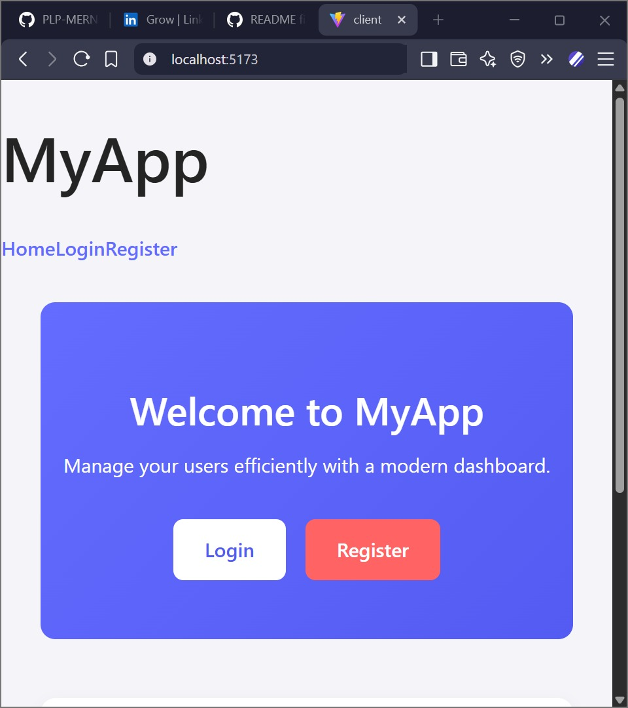

# MyApp - MERN Stack User Management Dashboard



MyApp is a modern **MERN (MongoDB, Express, React, Node.js)** application that allows you to efficiently manage users with a responsive dashboard. The app features **integration testing**, **modern UI**, and works seamlessly on both **desktop and mobile devices**.

---

## Features

* **User Management**

  * Add, view, and manage users with ease.
  * Real-time updates on the dashboard.
* **Responsive Design**

  * Works on desktop, tablets, and mobile.
  * Modern UI inspired by chat applications for smooth user experience.
* **Integration & Unit Testing**

  * Backend tested using Jest for reliability.
  * Frontend tested using React Testing Library.
* **Authentication**

  * Login and Registration pages with form validation.
* **Professional UI**

  * Cards, buttons, tables, and modals for a clean look.

---

## Installation

1. **Clone the repository**

```bash
git clone https://github.com/PLP-MERN-Stack-Development/testing-and-debugging-ensuring-mern-app-reliability-KyUCOMRADE
cd testing-and-debugging-ensuring-mern-app-reliability-KyUCOMRADE
```

2. **Backend setup**

```bash
cd server
npm install
```

3. **Frontend setup**

```bash
cd ../client
npm install
```

---

## Environment Variables

Create a `.env` file in the `server` directory:

```env
PORT=5000
MONGO_URI=your_mongodb_connection_string
MONGO_URI_TEST=your_mongodb_test_connection_string
NODE_ENV=development
```

---

## Running the Project

### Backend

```bash
cd server
npm run dev
```

### Frontend

```bash
cd client
npm run dev
```

Open `http://localhost:5173` (Vite default) to view the frontend.

---

## Testing Strategy

The project uses **unit, integration, and end-to-end (E2E) tests** to ensure reliability.

### Backend Tests (Jest)

* Unit tests for individual functions and models.
* Integration tests for RESTful API routes.
* Example:

```bash
npm run test:integration
```

### Frontend Tests (React Testing Library)

* Unit tests for components.
* Example:

```bash
npm run test
```

### End-to-End (Future)

* E2E testing can be implemented using Cypress for full user flows.

---

## Debugging Techniques Implemented

* **Logging** using `console.log` and `morgan` for requests.
* **Error handling middleware** in Express for catching errors globally.
* **Environment separation** for development, production, and test databases.
* **Unit and integration testing** to catch issues before deployment.
* **Try/catch blocks** in async functions for robust error management.

---

## Tech Stack

* **Frontend:** React, React Router, React Hot Toast, CSS/Responsive Design
* **Backend:** Node.js, Express.js
* **Database:** MongoDB, Mongoose
* **Testing:** Jest, React Testing Library
* **Other:** Vite for frontend bundling, dotenv for environment variables

---

## Folder Structure

```
client/          # React frontend
  src/
    components/  # Navbar, Modals, Buttons
    pages/       # Home, Login, Register, Dashboard
server/          # Backend Node.js + Express
  models/        # Mongoose models
  routes/        # Express routes
  tests/         # Unit & Integration tests
```

---

## Future Enhancements

* Real-time notifications using Socket.io.
* Advanced user roles & permissions.
* Dark/light mode toggle.
* More analytics and charts in Dashboard.
* E2E testing for complete user flows.

---

## License

This project is open-source and available under the MIT License.

---

## Author

**Joseph Chege**
GitHub: [https://github.com/KyUCOMRADE](https://github.com/KyUCOMRADE)
LinkedIn: [https://linkedin.com/in/JosephChege](https://linkedin.com/in/JosephChege)
